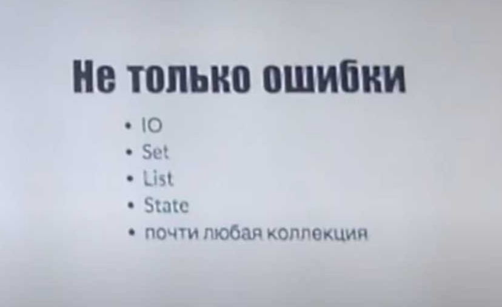
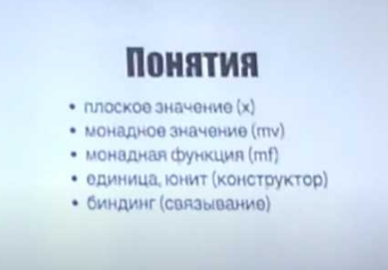

[snipboard.io](https://snipboard.io/)

# Небольшое введение в Scalatest

* https://habr.com/ru/post/209578

**ScalaTest** — ( www.scalatest.org ) это фреймворк для тестирования приложений, поддерживающий разные стили написания тестов.

Каждый из поддерживаемых стилей тестирования в **Scalatest** создан для использования в определенных целях.

---

Для использования каждого из стилей тестирования, необходимо создать класс, который будет реализовывать trait, в котором определён этот стиль тестирования.

Выбранный стиль определяет только то, как выглядят декларации тестов, все остальные возможности фреймворка будут работать одинаково, вне зависимости от того, какой из стилей тестирования был выбран.

---

### FlatSpec

**FlatSpec** — используют для юнит-тестов и для интеграционного тестирования.

**FlatSpec** это DSL позволяющий писать тесты в виде как можно более приближённом к написанию спецификации поведения тестируемого класса.

- **Assertions** в каждом стиле по умолчанию доступно 3 ассерта:
  - `assert` — для обычных проверок
  - `assertResult` — для проверки совпадения полученного и ожидаемого результата
  - `intercept` — для проверки что метод бросает ожидаемое исключение
- **Matchers**
  - `be` — одно из ключевых слов, которое можно использовать если подключить миксин *Matchers* в класс (который реализует тест)
- **Равенство** размер объекта, длина объекта
- **Проверка строк**
- **Проверка чисел**
- **Проверка булевых свойств**
- **Коллекции**
- **Свойства класса**
- **Соединение проверок логическими функциями**

### FeatureSpec

**FeatureSpec** — используют для приемочного тестирования.

**FeatureSpec** нацелен на создание приемочных тестов, облегчая программистам задачу работающим с не тестировщиками.

---

# Dan Rosen: Scala Monads

* В этом видеоуроке Дэн Розен покажет вам, как использовать возможности Scala для монадического проектирования, чтобы исключить повторяющийся шаблон в вашем коде.
  * `Tagir: Опциональные значения, Монады` **(** [HelloScala1~Main22](https://github.com/Home-SCALA3/MyHelloScala1/blob/master/src/main/scala/example/Main22.scala) **)** https://groz.github.io/scala/intro/monads
  * `Martin Odersky: Implicit Parameters` **(** [HelloScala1~Main33](https://github.com/Home-SCALA3/MyHelloScala1/blob/master/src/main/scala/example/Main33.scala) **)** https://www.youtube.com/watch?v=ieo9pV-0zEY
  * **(** [HelloScala1](https://github.com/ITEA-SCALA/HelloScala1) **)**  https://www.youtube.com/watch?v=Mw_Jnn_Y5iA  

## Scala with Cats (Scala – Introduction to Cats)

* `Конспект по Scala with Cats`: https://blog.maizy.ru/posts/scala-cats-summary
* `Lightbend for Scala`: https://github.com/ITEA-SCALA/LessonCatsZIO

[Практический пример с CodersBistro](https://github.com/ITEA-SCALA/lesson_4.public)
**(** [CodersBistro: akka-http-REST-application](https://github.com/CodersBistro/akka-http-REST-application) **)**

---

* В Idea IntelliJ IDEA есть возможность редактировать несколько строк.
  Использование: `Alt` + `Shift` + `Щелчок мышью`
* В Idea IntelliJ IDEA есть возможность генерировать объявление переменной, которая будет соответствовать правостороннему выражению.
  Использование: после правостороннего выражения нужно написать `.va` + `Щелчок Enter`
* В Idea IntelliJ IDEA есть возможность использовать автоматическое форматирование: `CTRL` + `ALT` + `L`
* В Idea IntelliJ IDEA есть возможность использовать конвертер синтаксического сахар (Desugar Scala Code...): `CTRL` + `ALT` + `D` 
* **(** [Полезные комбинации в IntelliJ IDEA](https://otus.ru/nest/post/494) **)**
* **(** [Полезные комбинации в IntelliJ IDEA](https://www.jetbrains.com/help/idea/discover-intellij-idea-for-scala.html) **)**

---

[Ссылка на запись 8 занятия](https://us02web.zoom.us/rec/share/MhCUP09CEzc7EZxNyu85ut-qnSqRZfkXj3djDZXHLTeCkDmT143l2t56ZoFBYELs.r1XE9mi1J7D-sl5c)

* `Scala Docs` https://github.com/Home-SCALA2/docs

---

Среди процедурных язык программирования, когда-то давно, был очень популярным **язык программирования `C`** - на котором потом писали Операционные Системы...

Как говорили в те времена, язык программирования `C` *был способен отстрелить себе ногу* ...

**(** Язык программирования `C` был одним из первых Объектно-Ориентированным языком программирования **)**

Тут дело в том, что это был такой революционный подход в программировании, где каждый разработчик, с помощью языка `C`, вполне мог написать собственный язык программирования.

В поставку `C`-подобных языков, например таких как: `C++`, `C#`, `Java` - были включены библиотеки сторонних разработчиков, которые упрощали жизнь программисту и позволяли уже пользоваться готовым кодом для своих бизнес-задач.  

Язык программирования `Scala` - это язык программирования не для промышленного программирования.

Тут дело в том, что это был такой революционный подход в программировании, где каждый разработчик мог применять любой стиль программирования для достижения эффективного подхода-решения бизнес-задач разной сложности. 

Существуют разные стили программирования: процедурный, ООП, функциональный, ... Но каждый из этих стилей способен более эффективно решать специфические задачи.
По этой причине нельзя говорить о том что какой-то один стиль программирования является лучше или хуже.

--

`Манада` в языке `Scala` - это такой революционный подход, который позволяет прозрачно описывать функциональное поведение для классов, которые будут использованы в исходном коде...

Основная проблема в большом проекте это условные операторы, которые разбросаны по всему исходному коду, но при этом принадлежат одному компоненту (который обрабатывает одну логическую единицу)...
При том условии что тот функционал, который описывается в разных местах исходного кода, должен работать синхронно! 

Так вот `манада` решает такие задачи, создавая для этого единый контейнер внутри которого описывается цепочка связанных задач.
И уже внутри такого контейнера контролируется состояние компонента в процессе прохождения по цепочке выполнения между задачами...

* [Конспект по Scala with Cats](https://blog.maizy.ru/posts/scala-cats-summary)
* 1000 разных подходов к определению, монада – механизм для последовательных вычислений операции
  * **.pure(a)** – создание монадического контекста из сырого значения
  * **.flatMap(f)** – извлечение значения из контекста и создание следующего контекста в последовательности
* любая монада – функтор, map легко построить из pure+flatMap
* laws:
  * **левоассоциативность:** pure(a).flatMap(f) == f(a). тут важно помнить об эффектах. именно по этой причине Try не Monad, так как если "снять" с него контекст монады при обычном вызове получим эффект – исключение, а если не снять то получим Failure.
  * **правоассоциативность:** m.flatMap(pure) == m.
  * **ассоциативность:** m.flatMap(f).flatMap(g) == m.flatMap(x => f(x).flatMap(g))
    * syntax:
      * .pure[T] (из cats.syntax.applicative)
      * .map(f) (из cats.syntax.functor)
      * .flatMap(f) (из cats.syntax.flatMap)
      * можно использовать for comprehensions из scala
  * при определении своих монад
    * .flatMap
    * .pure
    * .tailRecM – оптимизация для вложенных .flatMap вызовов. метод можно делать @tailrec

### Монада — это моноид в категории эндофункторов

* `Виталий Брагилевский * Монады не приговор`: https://www.youtube.com/watch?v=IkXg_mjNgG4

### Реализация
1. должна быть возможность туда поместить значение с помощью фабричных методов или конструкторов
2. применить операцию `map` для преобазования данных
3. и реализовать связывание с помощью операции `flatMap` (которая представляет из себя: применить какую-то операцию но не применять глубоко вложенные контейнеры)

**(** Простейший пример: монада `Option` (Scala), она же `Maybe` (Haskell) **)**

* `Кирилл Бяков (Туту.ру) * О монадах по-человечески`: https://www.youtube.com/watch?v=-aXZnNY2NNw

[snipboard.io](https://snipboard.io/)

* `Иван Гришаев * Монады`: https://www.youtube.com/watch?v=5-yjqPQH_fU

